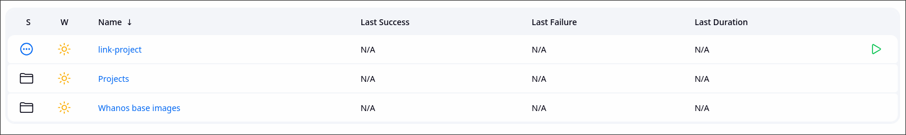

You are now ready to use Whanos! Follow the instructions below to get started.

As you can see, there is a few roles in the dashboard :

Let's go trough them part by part.

### Whanos base images

In this folder, you will find jobs used to build the base standalone & base images for the whanos project.

### link-project

Running this job, you will be prompted to enter a git repository URL, the whanos project supports both HTTPS and SSH URLs.

You can clone private repositories as long as you configure your SSH key in the jenkins credentials which can be done directly from the job arguments page.
